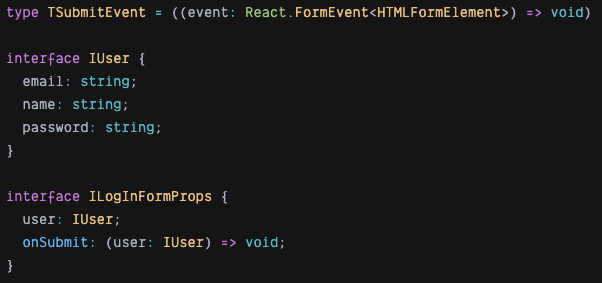
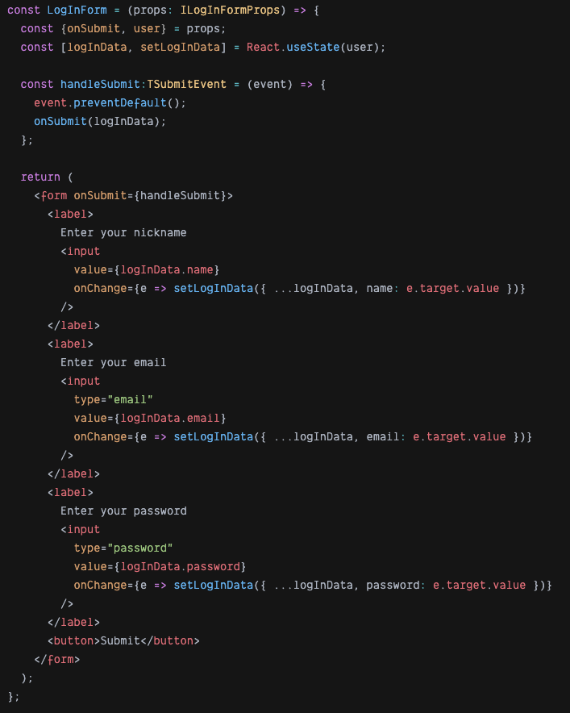
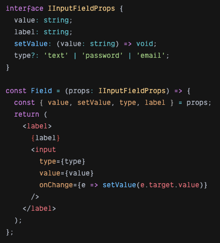
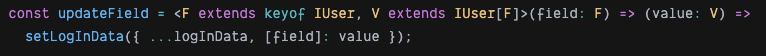
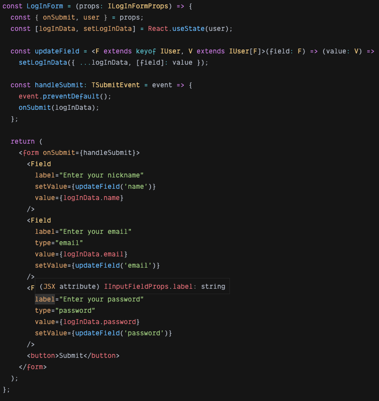

**KISS - "Keep the code simple and stupid."**

> _I think you are familiar with the concept of simple code. But what does "stupid" code mean? In my opinion, this is code that solves the problem using a minimum number of abstractions, while the nesting of these abstractions in each other is also minimal._

**YAGNI - "You ain't gonna need it"**

> _Code must be able to do what for what it created. We do not create any functionality that may be needed later, or that makes the application better, in our opinion. We only do require for the implementation of the task._

**DRY - "don't repeat yourself."**

> _The principle seems simple, but it has a catch: to get rid of duplicate code, you need to create abstractions. If these abstractions are not good enough, we violate the KISS principle._
>
> _The main task of this pattern is to create code that simplifies your code for updates and read. Before creating an abstract function or component simple way is to create some simple solution and after that change this code to more abstract._

### This is small examples with form.

#### You can look at how all pattern work

Now I am creating some simple form from login to site.

How you can see some parts are identical in this code. We can move this code to component and use.

Reading got easier. The name of the component corresponds to the problem it solves. The purpose of the element is evident. There is less code. So we are heading in the right direction!

The **next step** is to create a new function that updates the field. Yes, I agree that this function is not much stupid, but this function help simplify code and complete patter DRY.

This function currying, and in the first function, they get the name of the field. This function returns another function, which catches in parameter new value for a field in the state.

You can change this function and component, but in this example, I don't need to add some additional functionality, so I use pattern YAGNI.

After all those manipulation complete, we get a form like this.

At the end of this example, you can see how the code changed and simplified.
