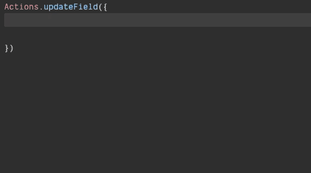

#### `Partial <T>` - constructs a type with all properties of `T` set to optional.

**How it work?**

```ts
interface A {
	title: string;
	subtitle: string;
}

type PartialA = Partial<A>;

interface B {
	title?: string;
	subtitle?: string;
}

A type PartialA and interface B is equal, but the type has shorter.
```

**Example of use**

I show you little examples of code from the Redux reducer and action creator.

```ts
interface IReducer {
  page: string;
  modal: string;
}

export const Actions = {
  setModal: (modal?: string) => ({ type: SET_MODAL, payload: modal }),
  setPage: (page: string) => ({ type: SET_PAGE, payload: page }),
};

export const reducer = (state = INIT_REDUX, action: TActions): IReducer => {
  switch (action.type) {
    case SET_MODAL: {
      return { ...state, modal: action.payload };
    }

    case SET_PAGE: {
      return { ...state, page: action.payload };
    }

    default: {
      return state ?? INIT_REDUX;
    }
  }
};
```

Suppose the reducer contains two or three fields, this code work. But if you have ten tracks and use code like this, you start to get some problem. If you need to update two areas one time, you think to create one more action creator or change the function or use two action creator in one place. The last variation can generate an error "Maximum update depth exceeded error" when you call one-by-one action creator from one reducer.

The easy way was using in this situation code like this.

```ts
export const Actions = {
  updateFields: (fields: Partial<IReducer>) => ({
    type: UPDATE_FIELDS,
    payload: fields,
  }),
};

export const reducer = (state = INIT_REDUX, action: TActions): IReducer => {
  switch (action.type) {
    case UPDATE_FIELDS: {
      return { ...state, ...action.payload };
    }

    default: {
      return state ?? INIT_REDUX;
    }
  }
};
```

_How can you use this function in the project?_



You can in call action update how much fields how much you want. But if you have hard logic with change/update fields prettier move this logic to the reducer and use new action creator.
